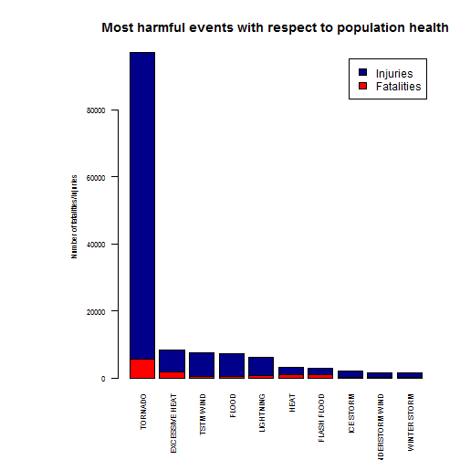
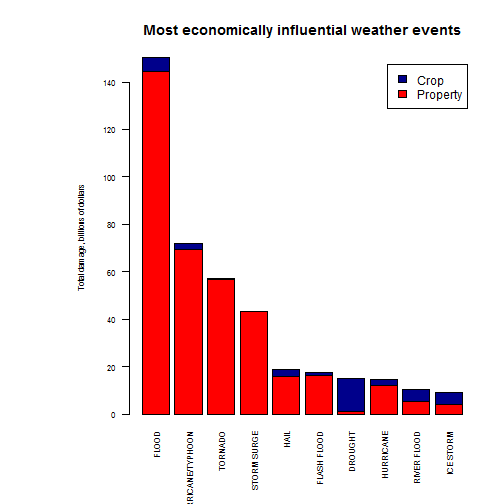

# Synopsis
This document analyses impact of weather events across the United States basing on National Weather Service Storm Database. Two basic questions are investigated:

* Across the United States, which types of events are most harmful with respect to population health?
* Across the United States, which types of events have the greatest economic consequences?

Results show that tornado is most harmful for population while flooding causes more damage to properties and crop than anything else. 

# Data Processing

1. Setting working directory and load libraries.

```r
setwd("D:/rprog/RepData_PeerAssessment2")
library(sqldf)
```

2. Read data to data frame.

```r
# Use this line to download raw file (doesn't work with knitr)
# download.file("https://d396qusza40orc.cloudfront.net/repdata%2Fdata%2FStormData.csv.bz2", destfile="./stormdata.csv.bz2")
data <- read.csv("./stormdata.csv.bz2")
```

3. Summarize injuries and fatalities data by weather event types.

```r
hsummary <- sqldf('SELECT
	EVTYPE as evtype,
	SUM(FATALITIES) AS fatalities,
	SUM(INJURIES) AS injuries
FROM data
GROUP BY EVTYPE') # Calculating total fatalities and injuries by event types
```

4. Sort data by total number of injured and died people

```r
hsummary <- sqldf('SELECT evtype, fatalities, injuries FROM hsummary ORDER BY fatalities+injuries DESC')
```

5. Select top 10 events

```r
hsummary <- hsummary[1:10,]
```

6. Prepare matrix for barplot

```r
vec <- t(hsummary[,-1])
colnames(vec) <- hsummary[,1]
```

7. Build barplot for most harmful events broken down by fatalities and injuries

```r
# Rotate labels
par(las = 2)
# Add more space for labels
par(mar=c(6,9,4,2) + 0.1)
# Build barplor
barplot(vec, col = c("red","darkblue"), main = "Most harmful events with respect to population health", ylab = "Number of fatalities/injuries", cex.axis = 0.7, cex.names = 0.7, cex.lab = 0.7, legend.text = c("Fatalities","Injuries"))
```

8. Convert damage values to numbers.

```r
dmgdata <- sqldf('SELECT
	EVTYPE as evtype,
	CASE
		WHEN PROPDMG = 0
		THEN 0.0
		WHEN UPPER(PROPDMGEXP) = "B"
		THEN PROPDMG * 1000000000
		WHEN UPPER(PROPDMGEXP) = "M"
		THEN PROPDMG * 1000000
		WHEN UPPER(PROPDMGEXP) = "K"
		THEN PROPDMG * 1000
		WHEN UPPER(PROPDMGEXP) = "H"
		THEN PROPDMG * 100
		WHEN UPPER(PROPDMGEXP) = "0"
		THEN PROPDMG
		ELSE 0.0
	END as propdmg,
	CASE
		WHEN CROPDMG = 0
		THEN 0.0
		WHEN UPPER(CROPDMGEXP) = "B"
		THEN CROPDMG * 1000000000
		WHEN UPPER(CROPDMGEXP) = "M"
		THEN CROPDMG * 1000000
		WHEN UPPER(CROPDMGEXP) = "K"
		THEN CROPDMG * 1000
		WHEN UPPER(CROPDMGEXP) = "H"
		THEN CROPDMG * 100
		WHEN UPPER(CROPDMGEXP) = "0"
		THEN CROPDMG
		ELSE 0.0
	END as cropdmg
FROM data')
```

9. Calculate sums by event types in billions of dollars

```r
dmgs <- sqldf('SELECT
	evtype,
	SUM(propdmg*1.0/1000000000) AS propdmg,
	SUM(cropdmg*1.0/1000000000) AS cropdmg
FROM dmgdata
GROUP BY evtype')
```

10. Get rid of zero damage rows and sort data by total damage to property and crop.

```r
dmgs <- sqldf('SELECT
	evtype,
	propdmg,
	cropdmg
FROM dmgs
WHERE propdmg > 0 OR cropdmg > 0
ORDER BY propdmg + cropdmg DESC')
```

11. Prepare matrix for barplot with top 10 events.

```r
dmgs <- dmgs[1:10,]
vec2 <- t(dmgs[,-1])
colnames(vec2) <- dmgs[,1]
```

12. Build barplot for most economically influential events broken down by damage to property and crop.

```r
# Rotate labels
par(las = 2)
# Add more space for labels
par(mar=c(6,9,4,2) + 0.1)
# Build barplor
barplot(vec2, col = c("red","darkblue"), main = "Most economically influential weather events", ylab = "Total damage, billions of dollars", cex.axis = 0.7, cex.names = 0.7, cex.lab = 0.7, legend.text = c("Property","Crop"))
```

# Results
The plot below shows total number of fatalities and injuries for the top 10 most harmful weather events accross the United States for all history of observations.

**Tornado** is by far the most harmful event. It's impact on population health exceeds anything else by 10 times.

 

The plot below shows total value of damage to property and crop caused by the top 10 most economically influential weather events accross the United States for all history of observations.

**Floods** caused twice more ecnomical consequences than its next competitor **Hurricanes and Typhoons**. **Tonadoes** and **Storm surges** make significant impact as well.

 

